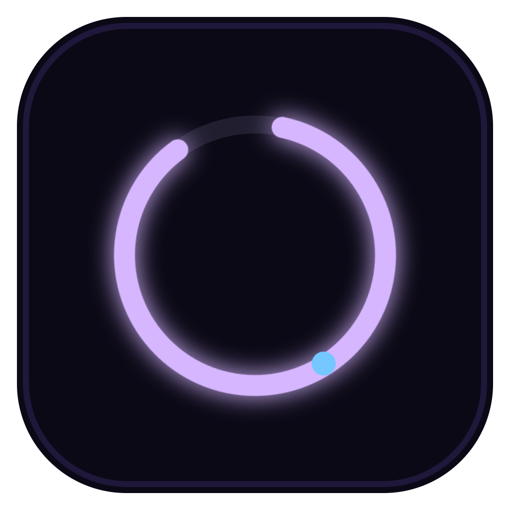
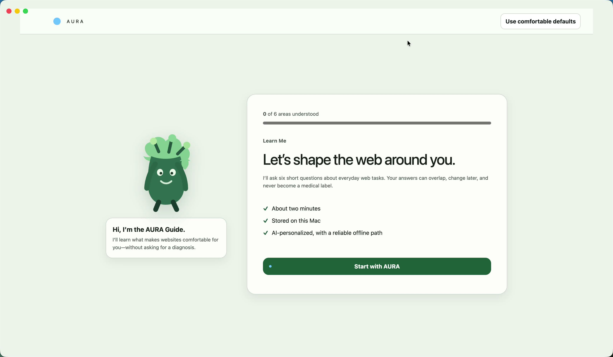
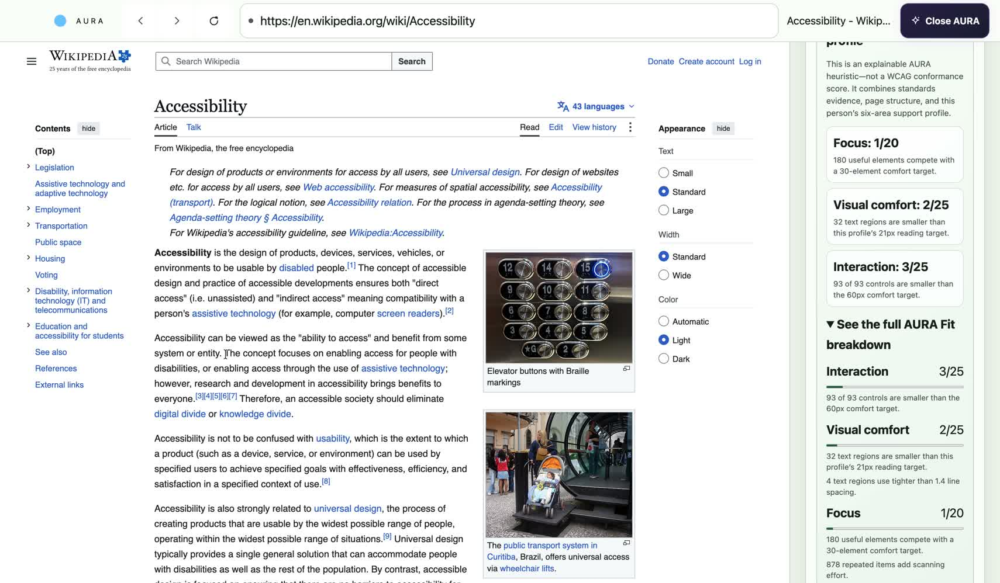
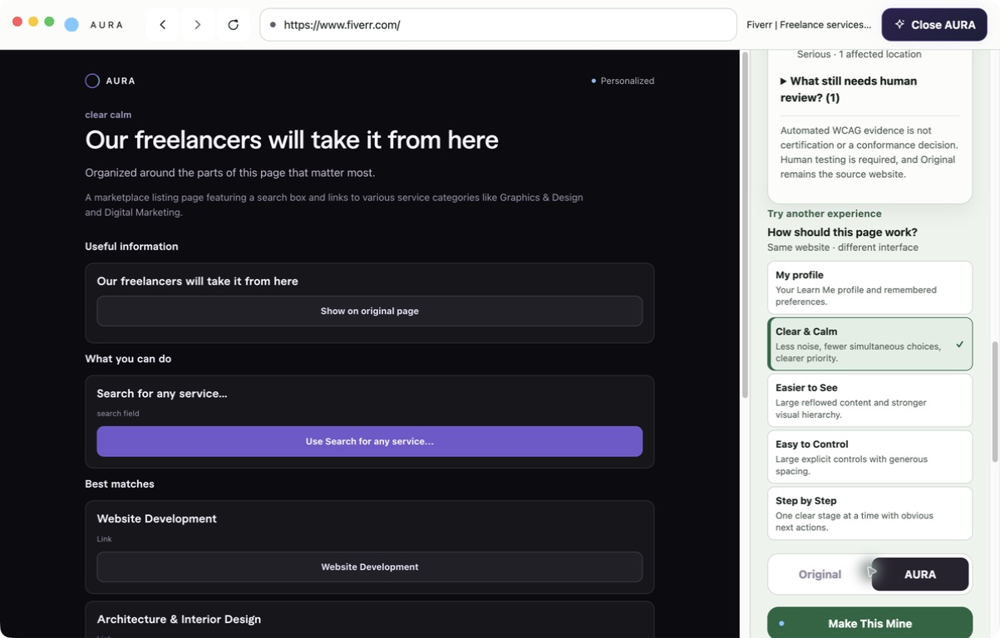
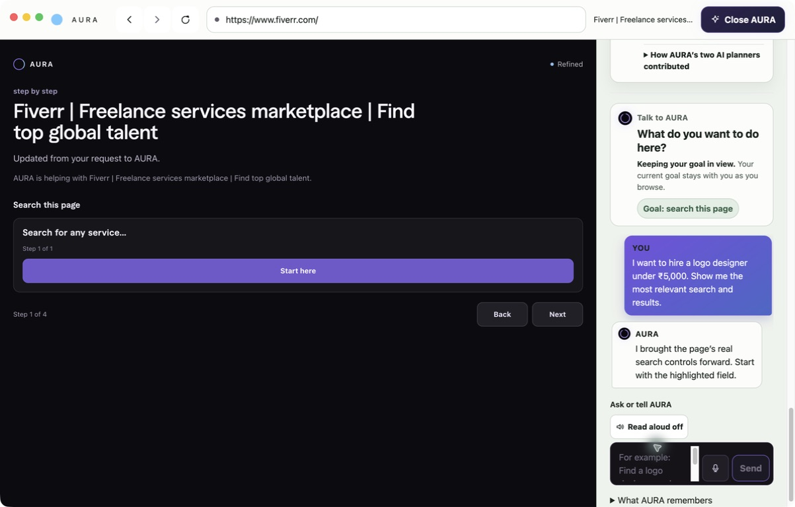
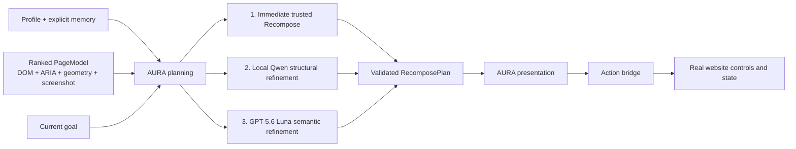
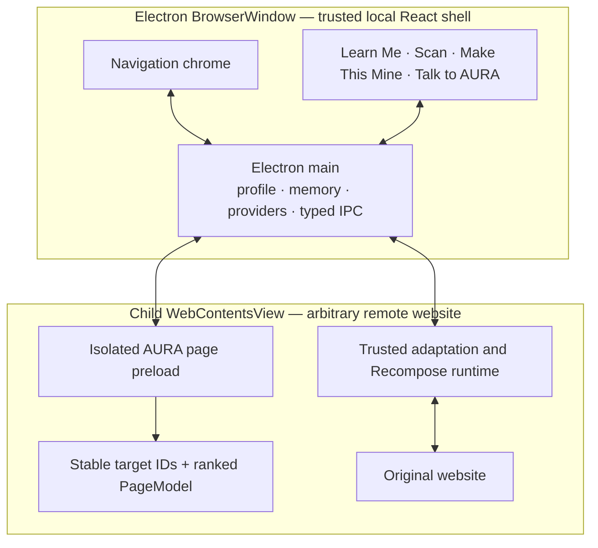

<div align="center">
  

  # AURA Browser

  **Adaptive User-Responsive Accessibility**

  A personalized accessibility browser that learns how a person uses the web,
  understands the page in front of them, and reshapes that real page around
  their needs and current goal.

  [](https://github.com/Phloraxx/AURA/actions/workflows/ci.yml)    

  [▶ Watch the complete narrated demo](artifacts/demo-video/AURA-feature-complete-demo.mp4) · [Watch the 80-second pitch](artifacts/demo-video/AURA-demo-complete-80s.mp4) · [Silent edit master](artifacts/demo-video/AURA-feature-complete-silent-master-1080p.mp4) · [Read the voiceover script](artifacts/demo-video/AURA-FULL-DEMO-SCRIPT.md) · [Product specification](docs/browser/README.md) · [Verified status](STATUS.md)
</div>

[](artifacts/demo-video/AURA-feature-complete-demo.mp4)

## The web should adapt to the person

Most accessibility tools begin with a diagnosis or a fixed mode. AURA begins
with functional needs and preferences that can overlap: visual comfort,
auditory support, motor precision, cognitive processing, attention and sensory
load, and language comprehension.

That produces one clear product journey:

1. **Learn Me** — a short, AI-personalized and non-diagnostic onboarding.
2. **Make This Mine** — a visible, reversible transformation of the real page.
3. **Talk to AURA** — natural language that changes, explains, or guides the
   interface instead of merely chatting about it.

The flagship moment is simple: open a normal website, press **Make This Mine**,
and watch the same page become a different interface for a different person.

## What AURA can do

### Learn Me

The AURA Guide asks one short question at a time across six functional support
areas. Trusted questions guarantee coverage; AI can personalize the order,
wording, acknowledgement, and bounded follow-ups. The onboarding interface
itself changes as AURA learns preferred text, controls, density, motion, and
explanation style.

- no diagnosis labels;
- large explicit choices and an optional free-text response;
- reliable deterministic fallback when cloud AI is unavailable;
- local, editable profile and explicit remembered preferences;
- profile-aware browser UI as well as profile-aware webpages.

### Scan this page

AURA keeps standards evidence and personalization honest and separate:

- **Automated WCAG 2.2 A/AA evidence** reports passed rules, failed rules,
  severity, affected locations, and checks that still need human review;
- **AURA Fit** is a separate, explainable profile-specific heuristic across
  Interaction, Visual comfort, Focus, Understanding, and Task simplicity;
- the interface never presents automated testing as WCAG certification or a
  conformance decision.

After adaptation, AURA rescans the active presentation and explains what was
resolved, what remains, what was introduced, and why the personalized fit
changed.



### Make This Mine

AURA does more than restyle the original layout. It creates a trusted
alternative presentation from real page content and controls while keeping the
original document loaded underneath.

The user can choose their learned profile or demonstrate four non-diagnostic
comfort patterns:

- **Clear & Calm** — fewer simultaneous choices and quieter hierarchy;
- **Easier to See** — large reflowed content and high-visibility controls;
- **Easy to Control** — large explicit controls with generous separation;
- **Step by Step** — one clear stage at a time;
- **My profile** — the person’s Learn Me profile and remembered preferences.

Every AURA action maps back to a validated current-page target. Form state and
real website controls remain underneath, and **Original ↔ AURA** restores the
source presentation without a reload.



### Talk to AURA

Talk to AURA is grounded in the current page, profile, session goal, and
explicit memory. It optimizes four action families:

- **Adjust** — “Make this easier,” “Make the controls bigger.”
- **Explain** — “Explain this section.”
- **Goal / Guide** — “I want to hire a logo designer under ₹5,000.”
- **Remember** — “Keep technical terminology. Remember that.”

Adjustments and goals regenerate the visible AURA presentation. Goal guidance
points to real page controls, and consequential actions remain with the user.

Push-to-talk uses OpenAI transcription when configured. Optional spoken replies
use installed native macOS voices through `/usr/bin/say`, with voice preview
and remembered selection.



## Three-pass page transformation



The current event pipeline is progressive:

```text
Make This Mine
      ↓
deterministic Recompose appears immediately
      ↓
local qwen3.5:4b-mlx prioritizes real page targets
      ↓
GPT-5.6 Luna adds deeper page meaning and goal refinement
      ↓
ready — with Original always one click away
```

Local or cloud failure does not remove the immediately useful trusted
presentation. Models return schema-validated target decisions only; AURA never
executes model-generated HTML, CSS, or JavaScript.

## Architecture



Key boundaries:

- one trusted React `BrowserWindow` shell;
- one child remote `WebContentsView`;
- isolated page preload with narrow typed IPC;
- ranked DOM/ARIA/geometry extraction — never first-N DOM truncation;
- screenshots plus selective CDP enrichment when useful;
- stale-page and stale-model results are rejected;
- profile and explicit memory are stored locally in versioned JSON.

The earlier WXT browser extension and Hono API remain in the monorepo as
reference clients. `apps/browser` is the canonical judged product.

## Run AURA on an Apple-Silicon Mac

### Requirements

- macOS on Apple Silicon;
- Node.js 20 or newer;
- pnpm 11.9.0;
- an OpenAI API key for cloud refinement, conversation, and transcription;
- optional: Ollama with `qwen3.5:4b-mlx` for the local fast path.

If `corepack` is unavailable, install the pinned pnpm version directly:

```bash
npm install --global pnpm@11.9.0
```

### Install and package

```bash
git clone https://github.com/Phloraxx/AURA.git
cd AURA
pnpm install --frozen-lockfile
pnpm browser:package:mac
```

Then launch with either:

```bash
pnpm browser:event
```

or double-click:

```text
Launch AURA.command
```

The event launcher reads a local `.env` when present and otherwise prompts
without echoing for a temporary OpenAI key. It never writes the key into the
repository.

### Development mode

```bash
pnpm install
pnpm browser:dev
```

### Optional local Qwen path

Install and start [Ollama](https://ollama.com/), then:

```bash
ollama pull qwen3.5:4b-mlx
```

AURA defaults to `http://127.0.0.1:11434` with an 8192-token requested context.
If Ollama is absent, deterministic and cloud paths continue to work.

### Environment

Copy the documented defaults and keep secrets local:

```bash
cp .env.example .env
```

Important browser variables:

```dotenv
OPENAI_API_KEY=
OPENAI_MODEL=gpt-5.6-luna
AURA_PAGE_REASONING_EFFORT=medium
AURA_LOCAL_MODEL=qwen3.5:4b-mlx
AURA_LOCAL_CONTEXT=8192
AURA_CONVERSATION_PROVIDER=cloud
AURA_TRANSCRIPTION_MODEL=gpt-4o-mini-transcribe
```

Never commit `.env` or an API key.

## Verify the repository

```bash
pnpm lint
pnpm typecheck
pnpm test
pnpm build
pnpm browser:test:e2e
```

GitHub Actions runs lint, typecheck, all unit/integration tests, all application
builds, and Electron Playwright E2E on every pull request and push to `main`.
Native `darwin-arm64` packaging and Apple voice behavior are verified on macOS.

The latest recorded event-Mac pass includes:

- 149 passing unit/integration tests and two intentionally skipped live-provider
  tests;
- 3 passing end-to-end Electron journeys;
- 27-site real-web coverage across articles, commerce, universities,
  government/public services, documentation, forms, SPAs, and listings;
- a packaged and launched `AURA.app`;
- local Qwen, cloud Luna, native speech, page scan, before/after evidence,
  conversation-driven Recompose, memory, and Original restoration.

See [`STATUS.md`](STATUS.md) for dated evidence and
[`tests/sites.md`](tests/sites.md) for the real-site matrix.

## Repository map

```text
apps/browser/       canonical Electron/React AURA Browser
apps/extension/     earlier WXT extension reference
apps/api/           legacy extension API/provider host
packages/shared/    shared profile, message, and semantic contracts
docs/browser/       canonical product, architecture, AI, UX, and testing specs
docs/assets/        product screenshots used by documentation
fixtures/           deterministic browser/extension regression pages
tests/sites.md      manual real-site compatibility matrix
artifacts/          demo video and rehearsal material
```

Start with [`docs/README.md`](docs/README.md) for the documentation map and
[`docs/browser/README.md`](docs/browser/README.md) for the authoritative reading
order.

## Product boundaries

AURA is an event prototype and an assistive personalization layer. It:

- does not diagnose a disability;
- does not replace accessible web development, browser zoom, screen readers, or
  operating-system accessibility tools;
- does not claim that automated testing determines WCAG conformance;
- does not promise perfect support for Canvas/WebGL, DRM-heavy surfaces,
  browser-internal pages, or every embedded authentication flow;
- prioritizes macOS Apple Silicon for the judged build.

## Contributors

AURA is an 80/20 project collaboration:

- **80% — [Sourav P Bijoy (@Phloraxx)](https://github.com/Phloraxx)**
- **20% — [Aradhana Rose (@aradhana225746-a11y)](https://github.com/aradhana225746-a11y)**

Verified identities and attribution notes are recorded in
[`CONTRIBUTORS.md`](CONTRIBUTORS.md) and normalized through [`.mailmap`](.mailmap).

## Contributing

Read [`CONTRIBUTING.md`](CONTRIBUTING.md), then follow
[`AGENTS.md`](AGENTS.md) and the canonical browser source of truth. Material
architecture or product-scope changes require an ADR update.

## Current status

`main` is the source of truth. W1–W8 are implemented and the verified Mac build
is in release hardening: feature scope is frozen, CI is green, and the remaining
work is operational rehearsal with the event key/network plus fixes for any
issue that rehearsal reveals.

For the complete evidence, configuration, known constraints, and packaged app
path, read [`STATUS.md`](STATUS.md).
